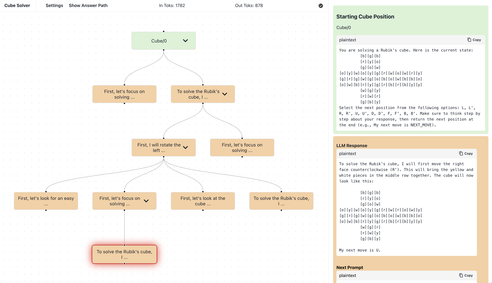
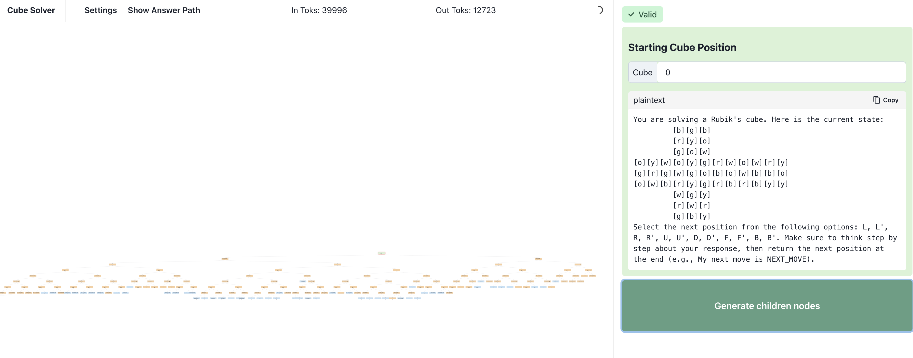

### Rubiks Cube Solver with LLMs

Search is seen as a pre-requisite to reasoning, where a base model proposes a few valid states and a discriminator guides states to explore. One small step in that direction is easy-to-verify explore/exploit tasks. I think [cube solving](https://cube20.org) is a good test-bed, and this interface allows testing multiple solution "paths" simultaneously. **LLMs perform poorly! While they understand the task, they lack any heuristic towards solving it.**

This interface plugs into the OpenAI API and explores different "branches" of cube solutions, giving the model 12 actions to perform on the cube (`L, L', R, R', U, U', D, D', F, F', B, B'`), verifying it makes a valid action, and re-prompting with the new cube.

<div align="center">

<br />
</div>

You can automatically expands paths as well:

<div align="center">

</div>


### Credits

- The front end is based on [normal-computing/branches](https://github.com/normal-computing/branches) (a visualization of code generation & verification), which was originally a fork of [paradigmxyz/flux](https://github.com/paradigmxyz/flux)
- The back end for verifying cubes, rotating and parsing in/out of text is based on [jasonrute/puzzle_cube](https://github.com/jasonrute/puzzle_cube)
- The "difficult" starting cube was taken from https://cube20.org/distance20s (takes at least 20 moves to solve!)
- Interested in programatic solvers? See [pglass/cube](https://github.com/pglass/cube/blob/main/rubik/solve.py) for a (non-optimal but deterministic) solver and [jasonrute/puzzle_cube](https://github.com/jasonrute/puzzle_cube) for training a CNN-based solver with RL

### Setup

```sh
# Run React front-end in first terminal:
npm install
npm run dev

# Run Flask backend in second terminal:
cd api
pip install -r requirements.txt
python execute.py
```